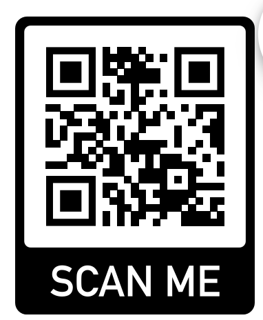

## Accès à l'application

L'application est déployée sur Render et accessible via le lien suivant :

🔗 [Lien vers l'application](https://pfe2-6pkl.onrender.com)



Vous pouvez scanner ce QR code pour accéder rapidement à l'application depuis un appareil mobile.

# Déploiement d'une Application Flask sur Render

Ce projet consiste à déployer une application Flask permettant la détection de vices de procédure à partir de documents PDF sur la plateforme Render.

## Prérequis

1. **Python 3.11 ou version compatible** : Assurez-vous que Python est installé sur votre machine.
2. **Dépendances** : Liste des bibliothèques nécessaires (voir fichier `requirements.txt`).
3. **Compte Render** : Créez un compte sur [Render](https://render.com/) pour le déploiement.

## Structure du projet

Voici la structure du projet sans le fichier `render.yaml` :

```
├── app/ (ou nom de votre application)
│   ├── app.py
│   ├── templates/
│   │   ├── index.html
│   ├── static/
│       ├── PdfDrop.png
│       ├── loi.png
├── requirements.txt
├── runtime.txt (facultatif, pour spécifier la version Python)
```

### Fichiers principaux

1. **`flask_backend.py`** :
   - Ce fichier contient le backend de l'application Flask.
   - Fonctionnalités clés :
     - **Réception des fichiers PDF** : Le fichier PDF téléchargé par l'utilisateur est capturé via un formulaire HTML.
     - **Extraction de texte** : Le texte est extrait du PDF à l'aide de la bibliothèque `PyPDF2`. Cela permet de convertir un document PDF en texte brut pour analyse.
     - **Prédiction via un modèle BERT** : Le texte extrait est envoyé à un modèle BERT fine-tuné pour effectuer une classification. Le modèle est capable de détecter 4 catégories (assignation ou notification avec ou sans vice de procédure).
     - **Précision et explication** : Le backend renvoie non seulement la catégorie prédite, mais aussi un pourcentage de confiance et une interprétation textuelle pour que l'utilisateur comprenne le résultat.

2. **`index.html`** :
   - Ce fichier est le point d'entrée de l'application pour l'utilisateur final.
   - Caractéristiques de l'interface utilisateur :
     - **Bouton de téléchargement PDF** : Stylisé à l'aide d'une image personnalisée (`PdfDrop.png`) pour améliorer l'expérience utilisateur.
     - **Affichage des résultats** : Les résultats de la prédiction (catégorie, précision et interprétation) sont affichés de manière claire et concise.
     - **Compatibilité responsive** : L'interface est adaptée pour fonctionner sur différents appareils (ordinateurs, tablettes, téléphones).

3. **Modèle de machine learning** :
   - **Entraînement du modèle** :
     - Les données utilisées pour entraîner le modèle incluent des documents PDF annotés, répartis en 4 classes.
     - Le modèle LegalBERT a été fine-tuné à l'aide de `transformers` et PyTorch, avec des techniques d'optimisation comme AdamW et une gestion fine du taux d'apprentissage.
     - La validation croisée a permis de garantir une bonne performance généralisée.
   - **Prédiction** : Le modèle prend en entrée du texte brut et renvoie une classe prédite accompagnée d'un score de confiance.

## Instructions de déploiement

### Étape 1 : Cloner le dépôt

Clonez votre projet à l'aide de Git :

```bash
git clone https://github.com/nom-utilisateur/nom-du-projet.git
cd nom-du-projet
```

### Étape 2 : Configurer le fichier `requirements.txt`

Assurez-vous que toutes les bibliothèques nécessaires sont listées dans `requirements.txt`. Exemple :

```
Flask==2.2.3
torch==2.0.1
transformers==4.34.0
PyPDF2==3.0.1
```

### Étape 3 : Ajouter un fichier `runtime.txt` (facultatif)

Si une version spécifique de Python est requise, ajoutez un fichier `runtime.txt` avec le contenu suivant :

```
python-3.11.11
```

### Étape 4 : Configurer Render

1. **Créer un service web** :
   - Accédez à Render et sélectionnez "New Web Service".
   - Liez votre dépôt GitHub.

2. **Configurer les commandes** :
   - Commande de build :
     ```bash
     pip install -r requirements.txt
     ```
   - Commande de démarrage :
     ```bash
     gunicorn app:app --bind 0.0.0.0:$PORT
     ```

### Étape 5 : Déployer

Une fois configuré, Render construira et déploiera automatiquement votre application. 

### Étape 6 : Vérification locale

Avant de déployer, testez l'application localement :

```bash
python app.py
```

Accédez à l'application sur `http://localhost:8080` pour vérifier son bon fonctionnement.

## Dépannage

1. **Problème de déploiement sur Render** :
   - Consultez les logs dans l'onglet "Logs" pour diagnostiquer les erreurs.
   - Vérifiez que tous les fichiers requis (`requirements.txt`, `templates/`, `static/`) sont bien présents dans le dépôt.

2. **Gestion des fichiers inutiles** : Ajoutez un fichier `.gitignore` pour exclure les fichiers temporaires ou inutiles :

```
__pycache__/
*.pyc
*.pyo
.env
```

3. **Problèmes liés au modèle** :
   - Assurez-vous que le modèle BERT est bien configuré dans le chemin spécifié (`./legal_bert_model`).
   - Vérifiez que les dépendances PyTorch et Transformers sont correctement installées.

## Fonctionnalités principales

1. **Téléchargement de PDF** : L'utilisateur peut télécharger un fichier PDF via une interface intuitive.
2. **Détection automatique** : Utilisation d'un modèle préentraîné pour détecter les vices de procédure dans le document fourni.
3. **Affichage des résultats** :
   - Explication détaillée du résultat.
   - Précision affichée en pourcentage.

## Auteur

Ce projet a été développé par [Votre Nom/Équipe].

